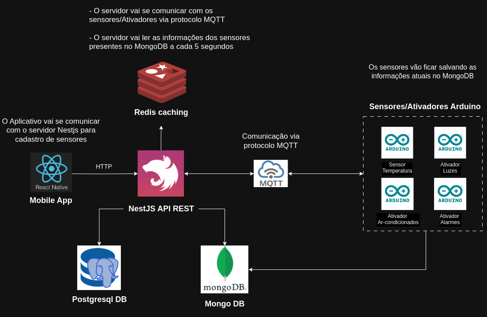

# 📱 SmartHome - Sistema de monitoramento de sensores/ativadores para automatização de casas.

---

# ⚙️ Arquitetura

---

## 📱 Aplicativo Principal

#### Sensores/Ativadores

- Cadastrar sensores/ativadores para aplicar na casa.
- Exibição dos sensores e ativadores separados por cômodos da casa
- Atualizar informações dos sensores/ativadoes
- Remover sensores/ativadores

#### Autenticação

- Cadastro no app usando conta do google ou facebook
- Login pelas mesmas plataformas acima

#### Grupo da casa

- Criar grupo da casa
- Adicionar membros da família
- Adicionar senha para entrar no grupo

---

## 🔰 Servidor

- CRUD sensores/ativadores
- Armazenar usuários
- Criar grupos da casa
- Adicionar membros ao grupo
- Remover membros do grupo
- Listar membros do grupo
- Comunicar com sensores

  ## Documentação das interfaces de comunicação
  https://documenter.getpostman.com/view/27080873/2s9YkocLxQ
